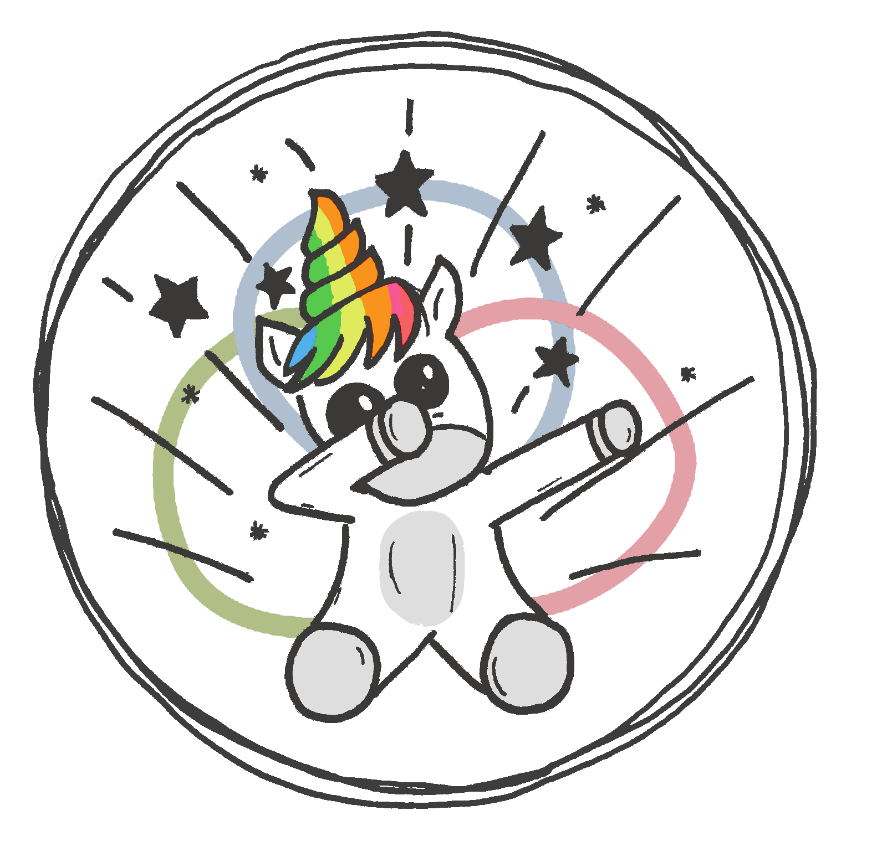
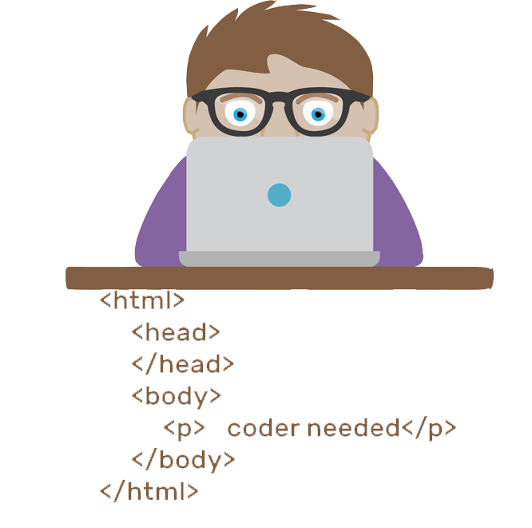
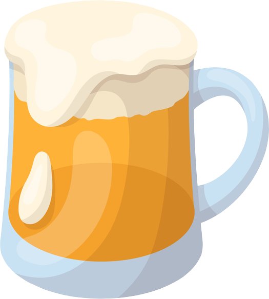
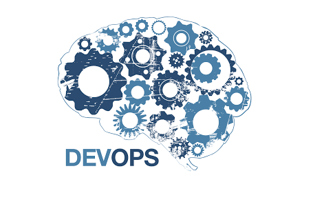

= [.technical.apero]#Technical Apero#
:organization: norsys
:position: Developer Advocate
:twitter: @norsyseasymaker
:avatar: images/easymakers.png

[.technical.apero%sponsoring]
== Sponsoring
[#img-norsys] 

[.cue]
****
include::speaker.adoc[tag=sponsoring]
****

== Speakers are you !

== Your ideas
image::images/idea.png[Developer,500px,400px,role=cover]

== Our Beer !

== The subject of the evening

== Infrastructure as code

== Continuous Delivery

== Communication
